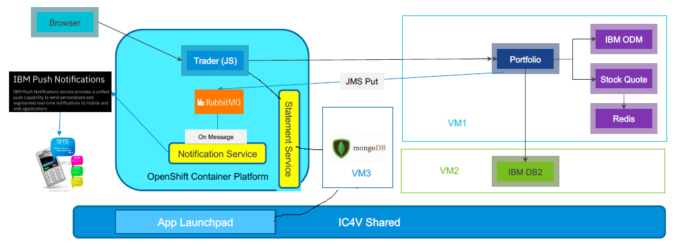

# StockTraderJilv2 Installation:

## Table Of Contens : 
[Introduction](#introduction)

[1. Deployment of IBM DB2](#deployment-of-ibm-db2)

[2. Deployment of Stock Trader application components](#deployment-of-stock-trader-application-components)

[3. Steps to install RabbitMQ using helm in OCP](#steps-to-install-rabbitmq-using-helm)

[4. Deploy notification service in OCP](#deploy-notification-service-in-ocp)

[5. Steps to install MongoDB using helm](#steps-to-install-mongodb-using-helm)

[6. Deploy Statement service in OCP](#deploy-statement-service-in-ocp)

[7. Deploy Web notification in OCP](#deploy-web-notification-in-ocp)

[8. Deploy new Tradr in OCP](#deploy-new-tradr-in-ocp)

[9. Migration guidelines to cloud](#migration-guidelines-to-cloud)

<a name="introduction"></a>
## Introduction
The IBM Stock Trader application is a simple stock trading sample where you can create various stock portfolios and add shares of stock to each for a commission. It keeps track of each porfolio's total value and its loyalty level which affects the commission charged per transaction. It sends notifications of changes in loyalty level. It also lets you submit feedback on the application which can result in earning free (zero commission) trades, based on the tone of the feedback.
It also send notification to the subscribed user and logged in user can download statement of the transaction.
The overall architecture looks like the following diagram:

<p align="center">

</p>

<a name="deployment-of-ibm-db2"></a>
### 1. Deployment of IBM DB2:

- Provision one ubuntu-16.04 DB2 VM2 
- Install Docker on Ubuntu OS [link](https://docs.docker.com/engine/install/ubuntu/)
- Run the following command to setup the containerized DB2:
    ```bash
    $ sudo docker pull stocktradersjilv2/st-db2
    $ sudo docker run --restart unless-stopped -itd --name mydb2 --privileged=true -p 50000:50000 -e LICENSE=accept -e DB2INST1_PASSWORD=db2inst1 -e DBNAME=STOCKTRD -v /data:/database stocktraders/st-db2
    $ sudo docker exec -ti mydb2 bash -c "su db2inst1"
    ```
- Verify the Image:
    ```bash
    
    $ sudo docker exec -i -t mydb2 /bin/bash
    $ su db2inst1
    $ db2 connect to STOCKTRD user db2inst1 using db2inst1
    ```
    -   Check the DB2 access from VM1 - Telnet port 50000
    -   Also can check the JDBC connection through eclipse plugin or Java program

<a name="deployment-of-stock-trader-application-components"></a>
### 2. Deployment of Stock Trader application components: 

- Prerequisite: DB2 VM is up and accessible
- Provision Ubuntu 16.04 VM
- Install Docker Engine [link](https://docs.docker.com/engine/install/ubuntu/)
- Install Docker compose [link](https://docs.docker.com/compose/install/)
    ```bash
    sudo curl -L "https://github.com/docker/compose/releases/download/1.26.0/docker-compose-$(uname -s)-$(uname -m)" -o /usr/local/bin/docker-compose
    sudo chmod +x /usr/local/bin/docker-compose
    #verify using the below command
    docker-compose --version
    ```
- Go to directory cd [stocktrader-jil-v2\ installation](/installation)
- Configure the docker-compose.yml file for **JDBC_HOST**, **MQ_HOST_NAME**, **MQ_PORT**, **MQ_QUEUE**
- Execute the below Command to pull the required images and then start service deployments
    ```bash
    COMPOSE_HTTP_TIMEOUT=300 docker-compose up -d
    ```
- You can check the logs of the services with below command using service name for(odm/trader/redis/stock-quote/portfolio)
    ```bash
    docker-compose logs | grep –i ‘<Service-Name>’
    ```
- Check the docker container status with “docker ps”
- Now once all the services are up and running –Import and deploy  stocktrader-jil-v2/src/portfolio/stock-trader-loyalty-decision-service.zip on ODM `http://<Ubuntu-VM-IP>:9060` (odmAdmin/odmAdmin)
- Now you can login to Trader UI with link `https://<Ubuntu-VM-IP>:9443/trader/login` (admin/admin)

**for more details follow portfolio [README](/src/portfolio)**

<a name="steps-to-install-rabbitmq-using-helm"></a>
### 3. Steps to install RabbitMQ using helm in OCP:
- Use curl command as mentioned below to create a get_helm.sh file to install helm.
    ```bash
    curl https://raw.githubusercontent.com/kubernetes/helm/master/scripts/get-helm-3 > get_helm.sh
    ```
- Get read, write and execute permission for the file "get_helm.sh" using the following command
    ```bash
    chmod 700 get_helm.sh
    ```  
- Execute the get_helm.sh file to install helm "./get_helm.sh"
- Once helm is installed, add bitnami repo to your setup using the following command
    ```bash
    helm repo add bitnami https://charts.bitnami.com/bitnami
    ```
- Now use the following command to install rabbitMQ using helm.
    ```bash
    helm install my-release --set rabbitmq.username=admin,rabbitmq.password=secretpassword,persistence.enabled=false,service.nodePort=32004,service.nodeTlsPort=32005,service.type=NodePort bitnami/rabbitmq --namespace stocktrader --version 6.25.13

    ``` 
    or  (If the statefulset-controller gives error, we can disable it)
    ```bash
    helm install my-release --set rabbitmq.username=admin,rabbitmq.password=secretpassword,persistence.enabled=false,service.nodePort=32004,service.nodeTlsPort=32005,service.type=NodePort,securityContext.enabled=false bitnami/rabbitmq --namespace stocktrader --version 6.25.13
    ```
- Set external IP to expose to host machine.
    ```bash
    oc expose service <service-name>
    ```
    ```bash
    oc patch svc <name> -p '{"spec":{"externalIPs":["<ip_address>"]}}'
    ```
##### Below are some important commands:
- To obtain the NodePort IP and Ports:
    ```bash
    A. export NODE_IP=$(kubectl get nodes --namespace default -o jsonpath="{.items[0].status.addresses[0].address}") 
    B. export NODE_PORT_AMQP=$(kubectl get --namespace default -o jsonpath="{.spec.ports[1].nodePort}" services my-release-rabbitmq)
    C. export NODE_PORT_STATS=$(kubectl get --namespace default -o jsonpath="{.spec.ports[3].nodePort}" services my-release-rabbitmq)
    ```
- To Access the RabbitMQ AMQP port:
    ```bash
    echo "URL : amqp://$NODE_IP:$NODE_PORT_AMQP/"
    ```
- To Access the RabbitMQ Management interface:
    ```bash
    echo "URL : http://$NODE_IP:$NODE_PORT_STATS/"
    ```
- Set external IP to expose to host machine.
    ```bash
    oc expose service <service-name>
    ```
    ```bash
    oc patch svc <name> -p '{"spec":{"externalIPs":["<NODE_IP>"]}}'
    ```

<a name="deploy-notification-service-in-ocp"></a>
### 4. Deploy notification service in OCP:
- Go to directory cd [stocktrader-jil-v2\src\notification](/src/notification)\manifest
- Create secrets for RabbitMQ and IBM Cloud Push services details:
    ```bash
    kubectl create secret generic rbq --from-literal=user=admin --from-literal=password=secretpassword --from-literal=vhost=/ --from-literal=host=172.17.76.32 --from-literal=port=32004 --from-literal=queue=stocktrader

    kubectl create secret generic ibmcloudpush --from-literal=tenenatid=77955822-7290-4cd9-b80a-3091b6892fee --from-literal=apikey=52XE_c9OkJJ6NfHDjTXxrYWcUUph86mwOLIZXyGlY2aq  --from-literal=region=.us-east.bluemix.net --from-literal=tag=STOCKTRADERS --from-literal=alertmsgurl=www.ibm.com
    ```
- Create or use the  project exits - oc new-project stocktrader or oc project stocktrader
- Apply the manifest file kubectl apply -f deployment.yml

**Note:** Make sure internet connectivity should be there in the pod
```sh
ping  iam.us-east.bluemix.net # from inside pod
```
if above command does not work then apply pod.yml file and remove deployment.yml.
```sh
kubectl delete -f deployment.yml
kubectl apply -f pod.yml
```

**for more details follow notification [README](/src/notification)**

<a name="steps-to-install-mongodb-using-helm"></a>
### 5. Steps to install MongoDB using helm:
##### If helm is not yet installed, use the following steps to install helm:
- Use curl command as mentioned below to create a get_helm.sh file to install helm.
    ```bash
    curl https://raw.githubusercontent.com/kubernetes/helm/master/scripts/get-helm-3 > get_helm.sh
    ```
- Get read, write and execute permission for the file "get_helm.sh" using the following command
    ```bash
    chmod 700 get_helm.sh
    ```  
- Execute the get_helm.sh file to install helm "./get_helm.sh"
- Once helm is installed, add bitnami repo to your setup using the following command
    ```bash
    helm repo add bitnami https://charts.bitnami.com/bitnami
    ``` 
##### If helm is installed then run the following command to install mongoDB:

```bash
helm install my-mongodb --set mongodbRootPassword=secretpassword,mongodbUsername=my-user,mongodbPassword=my-password,mongodbDatabase=my-database,service.nodePort=32008,service.type=NodePort bitnami/mongodb
``` 

or create docker container in VM directly.
```bash
sudo docker run -d --name=my-mongodb -e MONGODB_ROOT_PASSWORD=secretpassword -e MONGODB_USER="admin" -e MONGODB_DATABASE="stocktrader" -e MONGODB_PASS="secretpassword" -p 32008:27017 bitnami/mongodb:latest
```
<a name="deploy-statement-service-in-ocp"></a>
### 6. Deploy Statement service in OCP:
- Go to directory cd [stocktrader-jil-v2\src\statement](/src/statement)\manifest
- Create secrets for MongoDB and Host details:
    ```bash
    # NOTE : We will need to use "root" user for mongoDB and the authenticationdb should always be "admin"
    kubectl create secret generic mongodb --from-literal=user=root --from-literal=password=secretpassword --from-literal=host=172.17.76.32 --from-literal=port=32008 --from-literal=database=stocktrader --from-literal=authenticationdb=admin
    ``` 
- Apply the manifest files :
    ```bash
    kubectl apply -f deployment.yml
    kubectl apply -f service.yml
    kubectl apply -f ingress.yml
    ``` 
**Note:** For app LauchPad Mongo Instance
- Open port by running 
```sh
sudo ufw allow <PORT>
```
- enable ssh connection
```sh
rm -f /etc/ssh/sshd_not_to_be_run
systemctl start ssh
systemctl status ssh
```
- Try remote login to mongo db from outside the VM.

**for more details follow statement service [README](/src/statement)**

<a name="deploy-web-notification-in-ocp"></a>
### 7. Deploy Web notification in OCP:
- Go to directory cd [stocktrader-jil-v2\src\webnotification](/src/webnotification)\manifest
- Get the value of APPGUIID, CLIENTSECRET, REGION, TAG, SERVERWEBKEY
- Create secret using following command
    ```bash
    kubectl create secret generic ibmpushnotification --from-literal=appguiid=$APPGUIID --from-literal=clientsecret=$CLIENTSECRET --from-literal=region=$REGION --from-literal=tag= --from-literal=serverwebkey=$SERVERWEBKEY
    ``` 
- Apply the manifest files:
    ```bash
    kubectl apply -f deployment.yml
    kubectl apply -f service.yml
    kubectl apply -f Ingress.yml
    ``` 
- Set external IP to expose to host machine.
    ```bash
    oc expose service <service-name>
    ```
    ```bash
    oc patch svc <name> -p '{"spec":{"externalIPs":["<ip_address>"]}}'
    ```
**for more details follow web notification [README](/src/webnotification)**

<a name="deploy-new-tradr-in-ocp"></a>
### 8. Deploy new Tradr in OCP:
- Go to directory cd [stocktrader-jil-v2\src\tradr](/src/tradr)\manifests
- Get the value of AUDIENCE, ISSUER, TRADER_HOST, PORTFOLIO_HOST, STATEMENT_HOST, INGRESS_HOST.
- Create secret using following commands
    ```bash
    # add new secrets
    kubectl create secret generic trader-host --from-literal=host=$TRADER_HOST
    kubectl create secret generic portfolio-host --from-literal=host=$PORTFOLIO_HOST
    kubectl create secret generic ingress-host --from-literal=host=$INGRESS_HOST
    kubectl create secret generic statement-host --from-literal=host=$STATEMENT_HOST
    kubectl create secret generic jwt --from-literal=audience=$AUDIENCE --from-literal=issuer=$ISSUER
    ``` 
- Apply the manifest files:
    ```bash
    # Deploy the mainifests
    kubectl apply -f deployment.yml
    kubectl apply -f autoscaler.yml
    kubectl apply -f service.yml
    kubectl apply -f Ingress.yml
    ```
- Set external IP to expose to host machine.
    ```bash
    oc expose service <service-name>
    ```
    ```bash
    oc patch svc <name> -p '{"spec":{"externalIPs":["<ip_address>"]}}'
    ```

**for more details follow New Tradr [README](/src/tradr)**

<a name="migration-guidelines-to-cloud"></a>
### 9. Migration guidelines to cloud:

[above]: <#deployment-of-stock-trader-application-components>

1. While the VMs are migrated to cloud the VMs will recieve new IPs. So, some static ip changes will be needed in the docker-compose file inside installation directory.
2. Update the "JDBC_HOST" IP in the docker-compose file under "service -> portfolio -> environment"
3. Go to directory cd [stocktrader-jil-v2\ installation](/installation)
```sh
docker-compose down
```
```sh
docker-compose up -d 
```
4. wait until all container start, follow logs for any exceptions. docker-compose logs -f
5. Import and deploy stocktrader-jil-v2/src/portfolio/stock-trader-loyalty-decision-service.zip on ODM (follow step [above])
6. enter https://<Ubuntu-VM-IP>:9443/trader/login (follow step [above])
